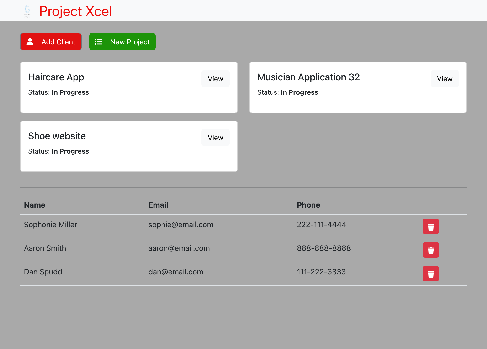

# Project-Management

## Description

This particular web application is an admin style application for project management. Some of the key features of this application is the ability to add, update, and delete clients and projects to display a very user friendly and streamline application. Some future development feature are implementing a calendar feature as well as a client side login to enable clients and customers to login and view the Dashboard.

## Installations
 Technologies used: 
 - Express
 - GraphQL
 - Node.js
 - Mongoose / MongoDB
 - Bootstrap

 ## Credits 

Collabators:
- Tyrrance Miller
- Ebony Ford
- Beyonce' Kinston

## License
 MIT License
 
